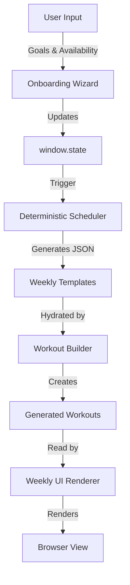
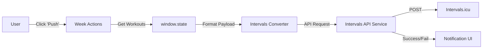

> **For Project Goals, Feature Roadmap, and Business Rules, see [_CONTEXT.md](_CONTEXT.md).**

# System Architecture & Map

> **Mental Model**: This application follows a **"Service-Oriented Singleton"** pattern (similar to Container/Presenter but with global state).

## High-Level Architecture

We use a separation between **Logic (Services)** and **Display (UI/Presenters)**, glued together by a global state object (`window.state`).

1.  **Global State (`window.state`)**: The single source of truth. All services read from and write to this object.
2.  **Services (`js/features/*/services/`)**: The "Containers" or "Brains". They fetch data, run algorithms (scheduling), and update the State. They allow no direct DOM manipulation.
3.  **Presenters (`js/ui/` & `weekly-ui.js`)**: The "Dumb Views". They read the State and render HTML. They emit events (calls to Services) but don't own business logic.

### Simply Put:
- **"I need to calculate a training plan"** → Call `SchedulingService` (Logic).
- **"I need to show the training plan"** → Call `WeeklyRenderer` (UI).
- **"I need to save to Intervals.icu"** → Call `IntervalsAPIService` (Utility).

---

## ⛔ The Danger Zone

The following files are **complex, load-bearing, and tightly coupled**. Do NOT refactor or significantly modify them without explicit instructions and a clear plan:

| File / Directory | Risk Level | Why It's Dangerous |
| :--- | :--- | :--- |
| `js/features/intervals-api/` | 🔴 CRITICAL | The sole interface to the Intervals.icu API. Modularized into focused services for uploader, formatter, and fetchers. |
| `js/features/ai/` | 🔴 CRITICAL | Orchestrates multi-provider AI prompts and response parsing. Breaking the parser breaks workout hydration. |
| `js/features/scheduling/` | 🟠 HIGH | The core Rule-Based engine. Highly calibrated for training science. Controls volume distribution and progression. |
| `js/features/weekly-plan/` | 🟠 HIGH | Handles load-bearing logic for workout building, drag-and-drop, and week actions. |
| `js/features/onboarding/` | 🟠 HIGH | Apple-like stepped wizard flow. Controls initial state setup and first-time user experience. |
| `js/core/deterministic-scheduler.js`| 🟠 HIGH | Phase-based workout rotation. Changes here break workout variety. |
| `js/weekly-ui.js` | 🟡 MEDIUM | Main rendering module. Heavily DOM-coupled. Uses `js/features/weekly-plan/` services. |

---

## Core Data Flows

### 1. Training Plan Generation Flow
How we go from "User goals" to "Workouts on screen".



### 2. Intervals.icu Sync Flow
How we push data to the external platform.



---

## Codebase Map & Directory Guide

```
js/
├── features/       # Feature-based modular architecture (NEW)
│   ├── intervals-api/  # Intervals.icu integration services
│   ├── scheduling/     # Core scheduling modules
│   ├── ai/             # AI provider clients and parsing
│   ├── weekly-plan/    # UI logic for weekly cards
│   └── onboarding/     # Apple-like stepped setup wizard
├── core/           # Core business logic and shared services
├── ui/             # Global UI components and settings
├── sports/         # Sport-specific adapters (Run/Cycle)
├── views/          # Page-level specific views
├── ai/             # Shared AI prompt patterns
└── *.js            # Entry point and legacy orchestration
```

### 🔵 Feature Layer (`js/features/`)

#### Intervals API (`js/features/intervals-api/`)
| File | Role | Key Functions |
|------|------|---------------|
| `services/api-client.js` | Core HTTP layer | `callIntervalsAPI()` |
| `services/workout-uploader.js` | Pushing/Deleting | `pushToIntervalsICU()`, `deleteRemoteWorkouts()` |
| `services/fitness-fetcher.js` | Athlete data | `fetchAthleteSettings()`, `fetchFitnessData()` |
| `services/step-formatter.js` | ICU Step Syntax | `formatStepsForIntervals()` |

#### Scheduling Engine (`js/features/scheduling/`)
| File | Role | Key Functions |
|------|------|---------------|
| `services/template-generator.js` | Main Orchestrator | `generateWeeklyTemplate()` |
| `services/progression-engine.js` | Progression curves | `calculateProgression()` |
| `services/frequency-optimizer.js`| Frequency logic | `optimizeFrequency()` |
| `services/volume-distributor.js` | Easy run filling | `distributeVolume()` |

#### AI Services (`js/features/ai/`)
| File | Role | Key Functions |
|------|------|---------------|
| `services/ai-orchestrator.js` | Entry Point | `preparePlanWithAI()`, `regenerateBlockWithFeedback()` |
| `services/provider-client.js` | LLM Gateway | `callAIProvider()`, `callGeminiAPI()` |
| `services/response-parser.js` | Result handling | `processAIResponse()` |
| `services/context-builder.js` | Prompt metadata | `buildWeeksContext()`, `getLast4WeeksSummary()` |

#### Weekly Plan (`js/features/weekly-plan/`)
| File | Role | Key Functions |
|------|------|---------------|
| `services/workout-builder.js` | Description building | `buildWorkoutDescription()` |
| `services/drag-handlers.js` | Day swapping | `handleWorkoutDrop()`, `handleDragStart()` |
| `services/week-actions.js` | Block actions | `pushBlockWorkouts()`, `resetWeeklyWorkouts()` |
| `services/availability-editor.js`| Per-week limits | `openWeekAvailabilityEditor()` |

#### Onboarding (`js/features/onboarding/`)
| File | Role | Key Functions |
|------|------|---------------|
| `services/wizard-state.js` | State & Navigation | `wizardNext()`, `wizardBack()` |
| `services/step-renderer.js` | UI Rendering | `renderWizardStep()`, `openQuickSetup()` |
| `services/onboarding-logic.js` | Helpers | `wizardFiveKInput()`, `selectSport()` |
| `services/connection-finalizer.js`| Final API logic | `testWizardConnection()`, `applyWizardSettingsAndGenerate()` |


### 🟢 Core Layer (`js/core/`)

| File | Role | Key Exports |
|------|------|-------------|
| `zone-service.js` | **Single source of truth for pace zones** | `ZoneService.calculateZonesFromLT()`, `getZonePace()` |
| `deterministic-scheduler.js` | Phase-based workout rotation | `generateDeterministicWorkout()` |
| `workout-library-structured.js` | Workout blueprints with steps | `WORKOUT_LIBRARY` |
| `plan-validator.js` | Validates generated plans | `PlanValidator.validate()` |
| `readiness-engine.js` | Readiness algorithm | `ReadinessEngine` |
| `constants.js` | Enums, phase definitions | `PHASES`, `WORKOUT_TYPES` |
| `state.js` | Global state management | `window.state` |


### 🟡 UI, Sports & Views

Refer to `js/ui/`, `js/sports/`, and `js/views/` for specialized UI components, sport-specific logic (Run/Cycle), and dashboard views.


### 🔴 Entry Points & Root (`js/`)

| File | Role |
|------|------|
| `main.js` | **App entry point**, orchestrates initialization |
| `ui.js` | Global DOM manipulation and main form handlers |
| `weekly-ui.js` | Main Weekly Plan view renderer |
| `workout-hydration.js` | Assigns dates/paces to generated workouts |
| `smart-planner.js` | High-level macro planning logic |
| `utils.js` | General utility functions |
| `progression.js` | Volume progression & Ramp Rate logic |

### 🔧 AI (`js/ai/`)

| File | Role |
|------|------|
| `prompt-builder.js` | Constructs AI prompts from context |

### 📱 PWA (`js/pwa/`)

| File | Role |
|------|------|
| `install-prompt.js` | PWA install banner logic |
